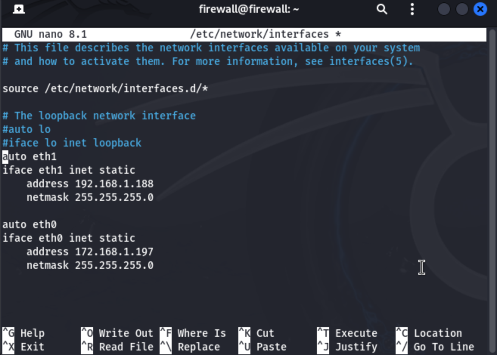
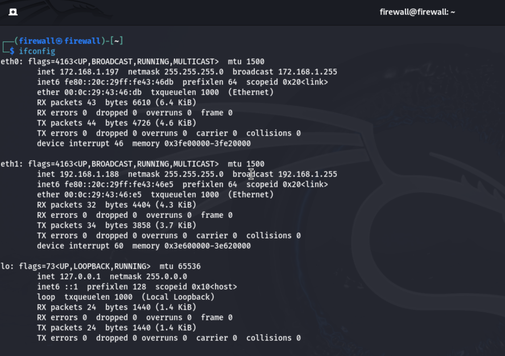

# Creating firewall using iptables

This article is shown for configuring custom firewall using iptables.

## Introduction to Firewalls

A **firewall** is a security system that monitors and controls incoming and outgoing network traffic based on predetermined security rules. Its primary purpose is to create a barrier between a trusted internal network and untrusted external networks, such as the internet, to protect against unauthorized access, cyberattacks, and data breaches.

## How Firewalls Work

### 1. Traffic Filtering
Firewalls inspect the data packets traveling to and from our network and decide whether to allow or block them based on a set of security rules.

### 2. Types of Firewalls

- **Packet Filtering Firewalls**: Check each packet that passes through the network for information such as IP addresses, packet type, port numbers, etc., and block or allow them based on the rule set.
- **Stateful Inspection Firewalls**: Keep track of active connections and make decisions based on the state of these connections as well as the packet data.
- **Proxy Firewalls**: Act as an intermediary between your network and external servers, examining data at the application level.
- **Next-Generation Firewalls (NGFWs)**: Include more advanced features like deep packet inspection, intrusion prevention systems (IPS), and application awareness.

### 3. Rule-Based Operation
Administrators define rules such as "allow traffic on port 80 (HTTP)" or "block traffic from a specific IP address." The firewall enforces these rules to manage traffic flow.

### 4. Monitoring and Alerts
Firewalls can log traffic details and alert administrators about suspicious activities, enabling them to take proactive measures.

By controlling data flow based on rules, firewalls help prevent unauthorized access, malware, and other security threats from compromising network integrity.

---
## Firewall we'll use
Here we'll be talking about software based firewalls only. We can use either `iptables(for linux)` or `pfsense(for FreeBSD-Based Systems)` to create firewall. iptables is a packet filter and pfSense is a NGFW) There are many other tools also for firewall.Like-

| **Operating System**       | **Custom Firewall Tools**                                                                 |
|----------------------------|-------------------------------------------------------------------------------------------|
| **Linux**                  | iptables, nftables, Firewalld, UFW, CSF, Shorewall, IPFire, pfSense                       |
| **FreeBSD**                | pf, ipfw, pfSense                                                                          |
| **macOS**                  | pf, Network Extension Framework, Little Snitch                                            |
| **Windows**                | Windows Filtering Platform (WFP), Windows Firewall, ZoneAlarm, Comodo Firewall, GlassWire |
| **OpenBSD**                | pf, ipfilter                                                                               |
| **Cloud**                  | AWS Security Groups, Azure NSGs, Google Cloud Firewall, Cloudflare                        |
| **Virtualization**         | Docker (iptables), VMware ESXi, Proxmox VE                                                 |

Depending on different criterias different tools are best. But overall for general use pfSense and for advance use iptables seems to be best. Because- 
- pfSense provides a web-based GUI, making it easy to manage without deep technical knowledge, yet it supports advanced features like VPN, load balancing, intrusion detection, etc. It’s a solid choice for a home or small office firewall.
- iptables allows for deep customization and fine-grained control over packet filtering, NAT, and connection tracking. It requires knowledge of the Linux networking stack and rule syntax, but it’s extremely powerful.

**Note:** Both of them works on different OS. iptables is a command-line tool for configuring the Netfilter framework in Linux. `Netfilter` is a set of hooks within the Linux kernel that allow for `packet filtering`, `NAT`, and `other networking operations`.pfSense is a free, open-source firewall and router software based on FreeBSD. It is typically used for network security and is often deployed on dedicated hardware or virtual machines to manage network traffic. You can use virtual machine to use FreeBSD to install pfSense. FreeBSD is a Unix-like, open-source operating system known for its performance, security features, and advanced networking capabilities. 

## Creating firewall using iptables:
As mentioned, iptables allows for deep customization and fine-grained control over `packet filtering`, `NAT`, and `connection tracking`.From the name of iptables we can assume that it is a collection of set of tables.
[Link to NAT](#subfield-1)

# Tables in iptables

In **iptables**, there are four main tables that organize different sets of rules for processing packets. Each table serves a specific purpose and is associated with certain *chains* for handling packet processing:

### 1. **Filter Table**(Default table)
- **Purpose**: This is the default table and is used for general packet filtering.
- **Chains**:
  - `INPUT`: Processes packets destined for the local system.
  - `OUTPUT`: Processes packets generated by the local system.
  - `FORWARD`: Processes packets routed through the system (not locally destined).
  

### 2. **NAT (Network Address Translation) Table**
- **Purpose**: Handles packet modifications for network address translation.
- **Chains**:
  - `PREROUTING`: Alters packets as soon as they arrive (before routing).
  - `OUTPUT`: Alters locally generated packets before routing.
  - `POSTROUTING`: Alters packets as they are about to leave the system.

### 3. **Mangle Table**
- **Purpose**: Used for specialized packet alterations, such as changing the TOS (Type of Service) or TTL (Time to Live) fields.
- **Chains**:
  - `PREROUTING`: Alters incoming packets before routing.
  - `INPUT`: Alters packets before they reach a local process.
  - `FORWARD`: Alters packets being forwarded through the system.
  - `OUTPUT`: Alters packets before they are sent out.
  - `POSTROUTING`: Alters packets as they are about to leave.

### 4. **Raw Table**
- **Purpose**: Used for configuring packets that should be exempt from connection tracking. This can improve performance in specific cases.
- **Chains**:
  - `PREROUTING`: Processes incoming packets before they hit connection tracking.
  - `OUTPUT`: Processes locally generated packets before connection tracking.

Each table serves a distinct role and interacts with specific chains to define how packets are processed and handled by the system.

---
Data is transferred through the OSI model in a layered process:

1. **Application Layer**: The sender’s application generates the data (e.g., an email).It provides services like file transfers, email, web browsing, and network management by enabling communication between software applications over a network. It ensures data is presented in a user-friendly format and supports protocols like HTTP, FTP, DNS, and SMTP for various internet and network functions.
2. **Presentation Layer**: Data is formatted, encrypted, or compressed.Provided by the correspondant app, not by the os. 
3. **Session Layer**: A session is established and maintained for communication.Authentication,Authorization,Session restoration,webinar. Provided by the correspondant app, not by the os. 
4. **Transport Layer**: Data is broken into smaller segments, and error-checking (e.g., TCP) is applied. End to End(Port to Port delivery), Reliability(for inorder delivery TCP and for unorder devlivery UDP is used), error control(checksum is used),congession control, Flow control(destination sends the window size first and according to that size of the segmentation size is assumed), MUX & DEMUX is used to maintain instraction of many applications (many to one TO one to many).
5. **Network Layer**: Routing information (IP addresses) is added for delivery across different networks.Host to  Host(Source to destination), Logical decision to send(IP contains Network and Host), Routing(Uses different router which decides the shortest paths using RIP/OSPF algorithms), Fragmantation(divide data into small portions), Congession control(gives feedback if there's any problem in any node) 
6. **Data Link Layer**: Frames are created with MAC addresses for local delivery.Hop to Hop/Node to Node delivery, Flow control(node to node, checks the size and speed of data accordind to recievers capacity), error control(node to node), access control, Mac address, frames.
7. **Physical Layer**: The actual transmission of raw bits occurs over physical media (cables, wireless). bit to signal, signal to bit happens here.

### Application layer protocols along with their port numbers & transfer protocols:
| **Protocol**        | **Port Number** | **Transport Protocol** | **Use**                                                                 |
|----------------------|-----------------|-------------------------|-------------------------------------------------------------------------|
| HTTP                | 80              | TCP                     | Used for transferring web pages and resources over the internet.       |
| HTTPS               | 443             | TCP                     | Secure version of HTTP using SSL/TLS for encrypted communication.       |
| FTP (Data)          | 20              | TCP                     | Transfers data files between systems.                                   |
| FTP (Control)       | 21              | TCP                     | Manages the connection and control commands for FTP.                   |
| SSH                 | 22              | TCP                     | Provides secure remote login and command execution.                     |
| Telnet              | 23              | TCP                     | Used for remote command-line access (insecure, largely deprecated).     |
| SMTP                | 25              | TCP                     | Sends email between servers and from clients to servers.                |
| DNS                 | 53              | TCP/UDP                 | Resolves domain names to IP addresses and vice versa.                   |
| POP3                | 110             | TCP                     | Retrieves emails from a mail server (downloads and removes from server).|
| IMAP                | 143             | TCP                     | Retrieves emails, allowing synchronization across multiple devices.     |
| LDAP                | 389             | TCP/UDP                 | Accesses and manages directory services like user information.          |
| LDAPS               | 636             | TCP                     | Secure version of LDAP using SSL/TLS for encrypted communication.       |
| DHCP (Server)       | 67              | UDP                     | Assigns IP addresses to devices on a network dynamically.               |
| DHCP (Client)       | 68              | UDP                     | Receives dynamic IP configuration from the server.                      |
| TFTP                | 69              | UDP                     | Transfers files, often used in network booting or configuration tasks.  |
| SNMP                | 161             | UDP                     | Manages and monitors devices on a network (e.g., routers, switches).    |
| SNMP (Trap)         | 162             | UDP                     | Receives alerts or notifications from managed devices.                  |
| RDP                 | 3389            | TCP                     | Provides remote desktop access to Windows systems.                      |
| SIP                 | 5060            | TCP/UDP                 | Manages signaling for voice over IP (VoIP) and multimedia sessions.     |
| SIP (Secure)        | 5061            | TCP                     | Secure version of SIP using encryption for VoIP communications.         |

#### Now enough basic is done! Let's get to hands on experience:
At first I'm trying to create such a setup where a computer will act as a firewall. Two external computer(Device2,Device4) will send traffic to the firewall and one internal computer(Device1) will will recieve traffic from firewall and send back output. 

To configure this setup:
- We'll need 4 vms.
- Link this 4vms such like the commands or traffics of device2 and device4 can't go directly to the device1 and vice versa.
- The firewall will act like a middleman here.

## Creating 4 vms:
I've created 4vms named Device1,Firewall,Device2,Device4 using vmware Fusion13. Example:

> **Note:**  
> If you have 8gb ram and and you are worried about your ram while creating vms, Don't worry! vmware uses shared ram. So you can easily create 4vms containing 4gb ram each.

## Network Adapter configuration
Here My default network adapter was NAT for all vms which means that it was sharing my mac's network. But to test the firewall each vm should be independent from others. So I used bridged netwrok to make it act like another physical machine on the network, receiving its own unique IP address from my router (or other DHCP server in the network).  
To switched to bridged go to network adapter option and select bridged autodetect.
(If you are on physical network choose specific adapters based on your physical network)

Apply this for all vms and boot.
> **Note:**  
> If you wanna know the consequene of switching to bridged network [click here](#bridgednetwork)

### Creating extra adapter:
As shown in the computer setup our firewall device must have 2 network adapter(input and output). But you'll see by default there's only one adapter in each device.(You can check it by going to networkadapter option or type ifconfig in terminal and check if there's eth0 & eth1 are available or not)  
But our firewall device must need to separate the internal and external networks. So it uses two different network adapters(Here eth0 & eth1 as shown in the setup picture). In my vm eth0 is by default available which I've checked through ifconfig. Now to create another network adapter-

click on add device -> network adapter -> bridged Autodetect and save.(Before adding you must shut down your vm first. Otherwise you'll not be able to click add device option) 

Now your network adapter is created. My Network adapter 2 is already created as shown in the picture. 

## Assign Static IP address:
After creating 2nd adapter my ifconfig looks like this-

Wah! Now both the adapters are visible here(eth0 & eth1). But there's a problem here. There's no IP adress is assigned for eth0 adapter. So I'll have to customly assign IP for this. Analysing the subnet mask I'll pick any IP for eth0 within the range except the IPs which are already assigned for other vms.  
So I've picked 197 for the IP and used this following command to assing that IP:

Then-

##### Now In macos:
- Press Ctrl + O to save
- Enter to confirm
- Ctrl + X to exit

Now if I check check the ifconfig again:

BOOM! IP: 192.168.1.197 is assigned for the adapter.  
If you find any vm is not having any ip then use this same process to assign.  

## Verify /etc/hosts configuration
The /etc/hosts file serves as a local, static DNS (Domain Name System) lookup table. When a device or service attempts to resolve a hostname, the system checks /etc/hosts before querying an external DNS server. With the /etc/hosts file configured on all VMs, you don’t need a DNS server to resolve hostnames. This is especially useful for isolated networks like mine (with virtual machines), where a DNS server may not be present.The VMs can communicate with each other by their hostnames.   
### Configuration:  

before configuring check hosts are already available or not: cat /etc/hosts.
You'll see other hostnames are not connected yet.Now-   

1.Type: sudo nano /etc/hosts
 

2. Enter your IP addresses along with vm names like this- 
  
   
192.168.1.197  firewall.example.com firewall   
192.168.1.188  firewall.internal.example.com firewall  
192.168.1.190  device1.example.com device1  
192.168.1.189  device2.example.com device2  
192.168.1.192  device4.example.com device4     

> **Note:**  
> Do not use this IPs and device names. Use your own.

##### In macos:
- Press Ctrl + O to save
- Enter to confirm
- Ctrl + X to exit

Now Check if other hosts are available or not: 

So all of them are available. Repeat this process in other VMs.
 Now  you can check if it's working or not:
 

 So we can see that now we can directly call other VMs by their hostname.

## Enabling IP forwarding on the Firewall VM
Enabling IP forwarding on the Firewall VM is an essential step to allow the firewall to route traffic between different network interfaces. By default, most Linux distributions have IP forwarding disabled for security reasons. When IP forwarding is enabled, the firewall can forward network traffic between the two network interfaces (e.g., eth0 and eth1) to allow proper routing of packets between the external and internal networks.
### Steps:
1. First check the current IP forwarding status:
 
If the output is net.ipv4.ip_forward = 0, IP forwarding is disabled.  
If the output is net.ipv4.ip_forward = 1, IP forwarding is enabled.

2. Enabling IP forwarding temporarily: To enable IP forwarding for IPv4, run the following command on the firewall VM:
 
This command temporarily enables IP forwarding until the system is rebooted.

3. Making IP forwarding permanent: 
 a.   
 b.

##### In macos:
- Press Ctrl + O to save
- Enter to confirm
- Ctrl + X to exit

  c. Apply the changes:
  
This reloads the system parameters from the configuration file and enables IP forwarding permanently even if the system is rebooted.

> **Note:**  
> Why enabling IP Forwarding?  
==> [click here](#ipForwarding) 

### Connectivity test

#### Using Telnet:
Device 2 will be connected to firewall.  
> **Note:**  
> At first check your telnet. you can check it by trying to connect to the own vm. for device4 I'm trying telnet 192.168.1.192 command to check if it connects or not. For me it was not connecting at first. So I configured the telnet first using openbsd-inetd. To know how I configured it [click here](#telnetConfigure) 

Here from firewall's terminal we're using device2's terminal. Using telnet this connection is made.

#### Using ssh:
> **Note:**  
> At first check your telnet. you can check it by trying to connect to the own vm. for device4 I'm trying telnet 192.168.1.192 command to check if it connects or not. For me it was not connecting at first. So I configured the telnet first using openbsd-inetd. To know how I configured it [click here](#sshConfigure) 

Here from firewall's terminal we're using device2's terminal. Using ssh this connection is made.

#### Connecting with ftp:
Installing ftp:

through ftp we are accessing to the target device's Music folder

#### Connecting with elinks:
To enable elinks first install it.

Then enable the apache server:

Now elinks can connect.

#### checking ping command:

ping is working fine.

#### checking the connection from device2 to firewall:

### connecting device1 from firewall:

#### checking the connection from device4 to firewall:

So all the connectivities are perfect.  
  
Now going to action.

### Block IP Address, Network and all incoming connections:
syntax: iptables type_of_firewall rule_add_or_rmv direction IP Action_accpet_or_drop

#### Blocking the IP address of device2:
Blocking IP:

Checking if the block is done:

trying to connect device2 with firewall

Failed! So the blocking is working.Now I'll try connect it from other device:

Other device are being able to connect smoothly. So it's blocking only device2.   
Now I'll remove the rule to get back to previous settings.

#### Blocking a network:

This will block all incomings from the network 198.168.

#### Blocking all incomings:

There will be no source. So every source incoming will be blocked.

### Blocking ports:
Now we'll block web access port.
 syntax: iptables type_of_firewall rule_add_or_rmv direction module_name protocol_name source_IP port_number Action_accpet_or_drop

 -n to show the source ip

now I'll try to check ssh:

ssh works completely fine as I've not blocked it. Now I'll check elinks:

elinks is not working. So blocking is done.

check elink for other device(device4)

Here it's working as expected.

#### Saving the rules to start after boot:
sudo iptables-save > input-rules-x  
checking the rule: cat input-rules-x   
to showing the rules in /etc/sysconfig/iptables: service iptables save
now checking: cat /etc/sysconfig/iptables

#### Restoring rules:
first flashing the rule: iptables -F
now checking the rules exist or not: iptables -L Input -n
no rules exists.
Now restore: iptables-restore <input-rules-x
now checking: iptables -L Input -n

### blocking ping:
block all ping's on firewall:

trying to ping firewall from device2:

### Filtering based on MACAddress:
syntax: iptables -A input -m mac --mac-source mac_address -j drop

### Direction filte:
syntax: iptables -A INPUT -p tcp -s ip_address -j drop

<!-- 
## sshConfigure

## telnetConfigure

Save and exit.

Telnet is now connected.

## ipForwarding
### Why Enabling IP Forwarding?

- **Traffic routing**: Enabling IP forwarding allows the firewall to route traffic between the two network interfaces (`eth0` and `eth1`). This is necessary for proper network communication between the external VMs (Device2 and Device4) and the internal VM (Device1).

- **Firewall functionality**: The firewall VM needs to forward packets between the internal and external networks while filtering or modifying them based on your firewall rules.

 --> 

<!-- 
## BridgedNetwork
Switching the network adapter option in VMware Fusion from NAT (Network Address Translation) to Bridged Network changes how your virtual machine (VM) connects to your network. Here's what happens:

### 1. Bridged Network Overview:
- The VM will connect directly to the same network as your host machine (e.g., your Wi-Fi or Ethernet network).
- It will act like another physical machine on the network, receiving its own unique IP address from your router (or other DHCP server in the network).

### 2. Effects of Switching to Bridged Network:
- **IP Addressing:** Your VM will no longer share the host's IP address (as with NAT). Instead, it gets its own IP address in the same subnet as the host machine.
- **Network Accessibility:** Devices on the same network as your host will be able to directly communicate with the VM (if allowed by firewall settings). This can make the VM easier to access for file sharing, SSH, or other networking tasks.
- **Firewall Behavior:** If you're building a firewall VM, using a bridged network allows the VM to act more like a true intermediary in the network. This can make it easier to route or filter traffic through the VM.
- **Host Independence:** The VM's internet access is no longer dependent on the host's NAT setup. Even if NAT services on the host are misconfigured, the VM should still have access to the network.

### 3. Potential Drawbacks:
- **Security Risks:** Since the VM is directly exposed to the network, it can be more vulnerable to external attacks, especially if the VM is not properly secured.
- **IP Conflicts:** If your network's DHCP server has limited IP addresses, you might run into conflicts or shortages.
- **Network Configuration Needs:** You may need to configure additional settings like static IPs or adjust your network's firewall rules to accommodate the VM.

### 4. When to Use Bridged Network:
- You want the VM to be treated as a separate device on the same network.
- You need the VM to provide services accessible to other devices on the network (e.g., a web server, database, or your firewall setup).
- You're testing network configurations, like firewall rules, that require multiple devices on the same subnet.

<!-- 
## Subfield 1
# Network Address Translation (NAT)

**Network Address Translation (NAT)** is a technique used in computer networking to modify the IP address information in the header of data packets as they pass through a router or firewall. The main purpose of NAT is to enable multiple devices on a local network to share a single public IP address when accessing resources on the internet.

## How NAT Works:

When a device on a local network (like a computer, smartphone, or server) wants to communicate with a device on the internet, the device sends packets to the router or firewall. The router, which typically has a private IP address (used only within the local network), performs the following steps:

### Source Address Translation:
- The router replaces the private IP address of the sending device with its own public IP address before forwarding the packet to the internet.
- The router keeps track of this translation in a **NAT table** so that responses can be correctly routed back to the right device.

### Destination Address Translation:
- When a response from the internet comes back to the router, the router checks the NAT table, identifies the corresponding private IP address, and forwards the response to the correct device on the local network.

## Types of NAT:

### 1. Static NAT (1:1 NAT)
In static NAT, a single private IP address is mapped to a single public IP address. This means that the mapping is consistent and never changes.  
This is useful for cases where a device inside a local network needs to be reachable from the outside world with a fixed public IP (e.g., web servers, FTP servers).  
**Example**: A private IP `192.168.1.2` is mapped to a public IP `203.0.113.5`.

### 2. Dynamic NAT
Dynamic NAT works similarly to static NAT but uses a pool of public IP addresses. When a device on the local network needs to access the internet, it is assigned a public IP address from the pool dynamically.  
This allows multiple devices to share a smaller number of public IP addresses.

### 3. Port Address Translation (PAT) or "NAT Overloading"
PAT is the most commonly used form of NAT. It allows multiple devices on a local network to share a single public IP address by differentiating the traffic based on port numbers.  
When a device sends a packet to the internet, PAT keeps track of the source port number along with the public IP address. When a response comes back, the router uses the source port number to identify which device the response is for.  
This is commonly referred to as "overloading" because it enables many devices to share a single IP address.

**Example**:  
Local network devices with private IPs (`192.168.1.2`, `192.168.1.3`) access the internet using a single public IP address (`203.0.113.5`) but with different source port numbers (e.g., port 1024 for `192.168.1.2` and port 1025 for `192.168.1.3`).

## Advantages of NAT:
- **IP Address Conservation**: NAT helps conserve public IP addresses by allowing multiple devices to share a single public IP. This is especially important given the limited availability of IPv4 addresses.
- **Security**: NAT can act as a basic form of security by hiding the internal private network structure from the outside world. External devices cannot directly initiate communication with devices behind a NAT router unless specifically configured (via port forwarding).
- **Simplified Network Management**: Using NAT, you don’t need a public IP address for every device in your local network, making it easier to manage and reducing the need for a large block of public IP addresses.

## Disadvantages of NAT:
- **Performance Overhead**: The router must maintain a translation table and process each packet, which adds some processing overhead. In very high-traffic networks, this can become a bottleneck.
- **Problems with Certain Applications**: Some applications (e.g., VoIP, certain online games, peer-to-peer applications) may have trouble with NAT because they rely on direct peer-to-peer connections, which can be blocked or altered by NAT. This can sometimes require specific configurations, such as port forwarding or DMZ setups.
- **End-to-End Connectivity Issues**: NAT can break the end-to-end principle of the internet, which assumes that devices can directly communicate with each other using their public IPs.

## Example of NAT in Action:
Imagine a home network with three devices:

- **Device A**: Private IP `192.168.1.2`
- **Device B**: Private IP `192.168.1.3`
- **Device C**: Private IP `192.168.1.4`

When these devices want to access the internet, the router (with public IP `203.0.113.5`) performs NAT.

1. **Device A** sends a packet to `www.example.com`. The router changes the source address from `192.168.1.2` to `203.0.113.5` and assigns a unique port (e.g., `1024`).
2. **Device B** sends a packet to the same destination. The router changes the source address from `192.168.1.3` to `203.0.113.5` but assigns a different port (e.g., `1025`).

When the response comes back to the router at `203.0.113.5`, the router uses the port numbers to direct the responses to the correct internal device. -->
